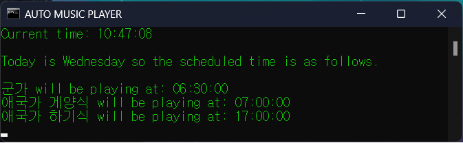

# Auto-Music-Player
Play music in the folder at the designated time.

## Steps
Copying the code from RAW is recommended. (Downloading as zip may result in unintentional error due to filetype)
1. Copy the code and Paste in notepad and save as BAT.
2. Change Music Folder Location, and time you want them to be played at.
## Why it's made
여단 상황병으로 근무를 서면서 기존에는 병사가 특정시간마다 음악(애국가 등)을 틀어야 했었는데 귀찮음을 해소하기 위해서 자동으로 음악을 틀어주는 윈도우 배치파일을 제작하였습니다.

다만 군 내에서 사용되는 PC는 허용된 프로그램이 극히 제한되어있어 제가 사용하던 프로그래밍 언어로는 제작이 불가능하였고, 따라서 윈도우에서 기본으로 제공하는 Windows Media Player로 재생하기 위해 플레이리스트를 자동으로 생성하여 특정시간에 실행되게끔 제작하였습니다. 이후 보안성검토를 마치고 인정받아 부대 해체 전까지 공식적으로 사용하게 되었습니다.
